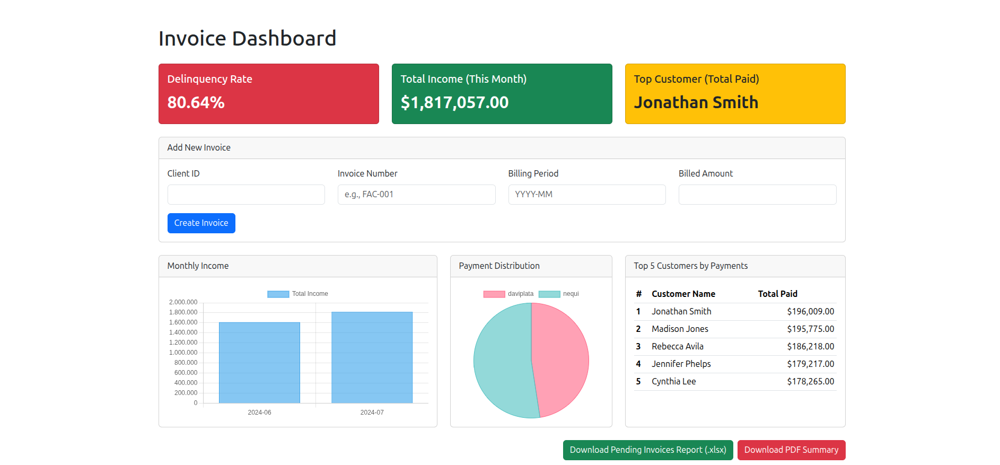

# ExpertSoft - Financial Analytics Dashboard

A full-stack web application designed for ExpertSoft to transform raw financial data into a powerful analytics dashboard. This project migrates data from Excel into a normalized SQL database, serves it via a RESTful API, and presents key business insights through an interactive web interface.

 


## Table of Contents

- [Project Description](#project-description)
- [Features](#features)
- [Key Performance Indicators (KPIs)](#key-performance-indicators-kpis)
- [Tech Stack & Architecture](#tech-stack--architecture)
- [Database Schema (ERD)](#database-schema-erd)
- [File Structure](#file-structure)
- [Getting Started](#getting-started)
- [API Endpoints](#api-endpoints)
- [Author](#author)
<!--  - [Live Demo](#live-demo)  Deployment -->


## Project Description

This project addresses the challenge of managing disorganized financial data from Fintech platforms like Nequi and Daviplata. It provides a complete solution that includes data normalization, bulk loading into a relational database, a REST API for data management, and a dynamic frontend dashboard for business intelligence.

The application serves as a powerful tool for stakeholders to gain immediate insights into key financial metrics, track performance, and generate reports.

## Features

### Backend (API)
-   **RESTful API:** Built with Node.js and Express.js.
-   **Full CRUD Functionality:** For managing invoices, including server-side validation.
-   **Data Seeder:** Automated bulk loading of normalized data from CSV files.
-   **Advanced Analytics Endpoints:** Optimized SQL queries to calculate complex business metrics.
-   **Pagination:** Efficiently handles large datasets for the invoice list.

### Frontend (Dashboard)
-   **Interactive Dashboard:** Single-page application built with vanilla JavaScript (ES6 Modules).
-   **Data Visualization:** Dynamic charts (Bar, Pie) powered by **Chart.js**.
-   **KPI Cards:** At-a-glance view of the most critical business metrics.
-   **Dynamic Table:** A paginated table for browsing, creating, editing, and deleting invoices.
-   **Reporting:** Client-side generation of reports in **Excel (.xlsx)** and **PDF** formats.

## Key Performance Indicators (KPIs)

The dashboard provides real-time insights into the following KPIs:

1.  **Delinquency Rate:** The percentage of total billed money that is currently tied up in unpaid invoices. A critical indicator of collection efficiency.
2.  **Monthly Income:** A bar chart showing the trend of total income from completed transactions over time.
3.  **Payment Distribution:** A pie chart illustrating the proportion of revenue generated through each payment platform (e.g., Nequi vs. Daviplata).
4.  **Top 5 Customers:** A ranked list identifying the most valuable customers based on their total payments.

## Tech Stack & Architecture


-   **Backend:** Node.js, Express.js, MySQL (with `mysql2/promise`), `dotenv` for environment management.
-   **Frontend:** HTML5, JavaScript (ES6 Modules), Bootstrap 5 for styling.
-   **Data Visualization:** `Chart.js`
-   **Reporting:** `SheetJS (xlsx)` for Excel, `jsPDF` & `html2canvas` for PDF generation.
-   **Architecture:** A **Layered (N-Tier) Architecture** was implemented to ensure a clear **Separation of Concerns (SoC)**:
    -   **Routes Layer:** Defines API endpoints.
    -   **Controller Layer:** Manages HTTP request/response flow.
    -   **Service Layer:** Contains all business logic and database queries.

## Database Schema (ERD)

The database was designed following normalization principles to ensure data integrity and eliminate redundancy.

  

## File Structure

The project is organized into two main directories: `backend` and `frontend`, clearly separating the server-side logic from the client-side application.

```bash
    public-library/
├── .gitignore # Specifies intentionally untracked files to ignore.
├── README.md # This documentation file.
│
├── docs/
│ ├── data.xlsx # The initial data on excel file type
│ ├── ExpertSoft API - Test.postman_collection.json # Postman Test Collection for the API 
│ ├── dashboard-screenshot.png
│ └── uml-diagram.png # UML diagram illustrating the system architecture.
├── backend/
│ ├── .env # Stores environment variables (database credentials).
│ ├── package.json # Defines the Node.js project and its dependencies.
│ ├── package-lock.json # Records the exact versions of dependencies.
│ ├── node_modules/ # Contains all installed npm packages.
│ │
│ ├── src/ # Main source code for the API.
│ │ ├── config/
│ │ │ ├── database.js # Configures and exports the MySQL connection pool.
│ │ │ └── schema.sql # The SQL script to create the database and tables.
│ │ │
│ │ ├── controllers/ # Handles the logic for incoming requests and outgoing responses.
│ │ │ ├── client.controller.js
│ │ │ ├── invoice.controller.js
│ │ │ ├── kpi.controller.js
│ │ │ └── transaction.controller.js
│ │ │
│ │ ├── routes/ # Defines the API endpoints and maps them to controllers.
│ │ │ ├── client.routes.js
│ │ │ ├── invoice.routes.js
│ │ │ ├── kpi.routes.js
│ │ │ └── transaction.routes.js
│ │ │
│ │ ├── services/ # Contains the core business logic and database interactions.
│ │ │ ├── client.service.js
│ │ │ ├── invoice.service.js
│ │ │ ├── kpi.service.js
│ │ │ └── transaction.service.js
│ │ │
│ │ └── server.js # The entry point of the backend application; creates and starts the Express server.
│ │
│ └── seeders/ # Scripts to populate the database with initial data.
│ ├── data/ # The source CSV files for seeding.
│ │ ├── clients.csv
│ │ ├── invoices.csv
│ │ ├── platforms.csv
│ │ └── transactions.csv
│ ├── load-clients.js # Script to load client data.
│ ├── load-invoices.js # Script to load invoice data.
│ ├── load-platforms.js # Script to load platform data.
│ ├── load-transactions.js # Script to load transaction data.
│ └── run-seeders.js # The main script that executes all seeders in order.
│
├── frontend/ # Contains the entire user interface (the client application).
│ └── js/ 
│ │ └── services/ 
│ │ │ └── api.js # Centralizes all 'fetch' requests to the backend.
│ │ └── ui/ 
│ │ │ └── ui.js # Module dedicated to handling all DOM manipulation.
│ └── app.js # The main entry point; orchestrates events, API calls, and UI updates.
└── index.html # The single HTML page for the entire application.

```

## Getting Started

### Prerequisites
-   Node.js (v18 or higher)
-   MySQL Server

### Installation & Setup

1.  **Clone the repository:**
    ```bash
    git clone https://github.com/Elimge/fullstack-financial-dashboard.git
    cd fullstack-financial-dashboard
    ```

2.  **Setup the Backend:**
    ```bash
    cd backend
    npm install
    ```

3.  **Create the Environment File:**
    -   Create a `.env` file in the `backend` directory.
    -   Add your MySQL credentials:
        ```env
        DB_HOST=localhost
        DB_USER=root
        DB_PASSWORD=your_mysql_password
        DB_DATABASE=pd_miguel_canedo_manglar
        ```

4.  **Create and Populate the Database:**
    -   Log in to your MySQL console: `mysql -u root -p`
    -   Run the schema script (make sure you are in the `backend` folder):
        ```sql
        source src/config/schema.sql;
        ```
    -   Exit MySQL and run the seeder script:
        ```bash
        node seeders/run-seeders.js
        ```

5.  **Run the Backend Server:**
    ```bash
    npm run dev
    ```
    The API will be running at `http://localhost:3005`.

6.  **Run the Frontend:**
    -   Use the **Live Server** extension in VS Code.
    -   Right-click on `frontend/index.html` and select "Open with Live Server".

## API Endpoints

The API is versioned under `/api/v1/`.

| Method   | Endpoint                          | Description                               |
| :------- | :-------------------------------- | :---------------------------------------- |
| `GET`    | `/invoices`                       | Get a list of all invoices.               |
| `POST`   | `/invoices`                       | Create a new invoice.                     |
| `GET`    | `/invoices/:id`                   | Get a single invoice by its ID.           |
| `PUT`    | `/invoices/:id`                   | Update an existing invoice by its ID.     |
| `DELETE` | `/invoices/:id`                   | Delete an invoice by its ID.              |
| `GET`    | `/invoices/pending`               | **Advanced:** Get all pending invoices.   |
| `GET`    | `/clients/total-paid`             | **Advanced:** Get total paid by clients.  |
| `GET`    | `/transactions/platform/:name`    | **Advanced:** Get transactions by platform|
| `GET`    | `/kpis/monthly-income`            | **(KPI)** Get total income per month.     |
| `GET`    | `/kpis/payment-distribution`      | **(KPI)** Get income distribution by platform.|
| `GET`    | `/kpis/top-customers`             | **(KPI)** Get the top 5 customers by payment.|
| `GET`    | `/kpis/delinquency-rate`          | **(KPI)** Get the overall delinquency rate.|

## Author

-   **Miguel Canedo**
-   Github: [@Elimge](https://github.com/Elimge)
-   **Email:** elimge@outlook.com